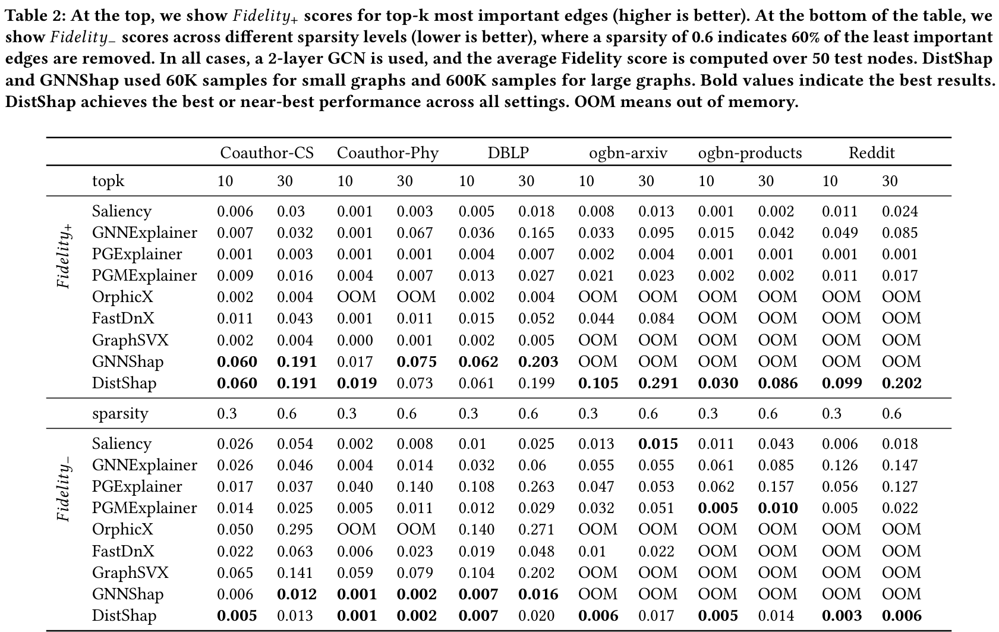
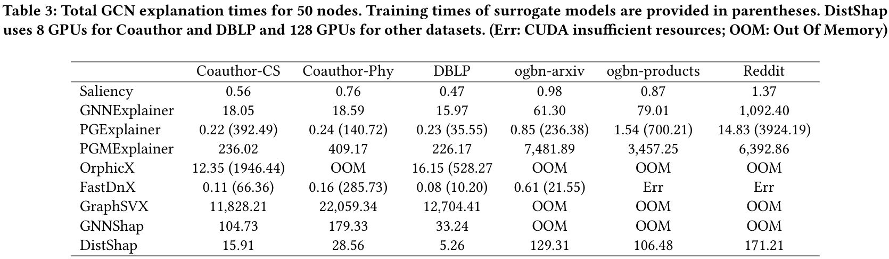
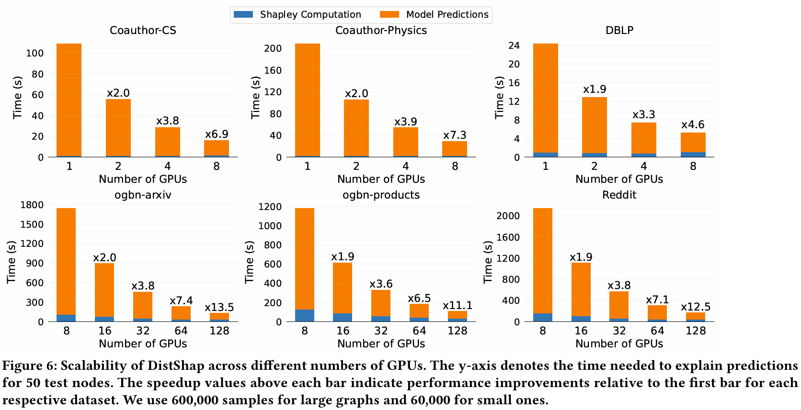
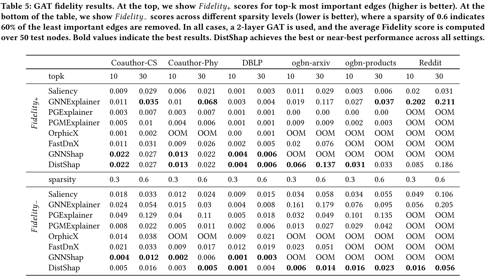
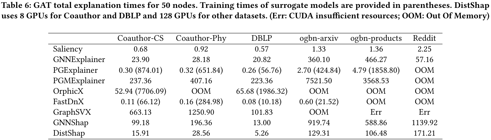
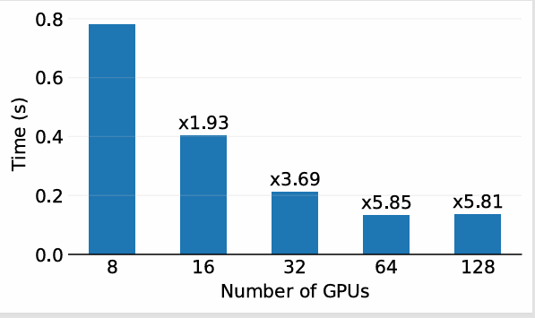

# Scalable GNN Explanations with Distributed Shapley Values

> We develop DistShap, a parallel algorithm that distributes Shapley value-based explanations across multiple GPUs. DistShap samples subgraphs in a distributed setting, executes GNN inference in parallel across GPUs, and solves a distributed least squares problem to compute edge importance scores. DistShap outperforms most existing GNN explanation methods in accuracy and is the first to scale to GNN models with millions of edges by using 128 GPUs.

The DistShap code is based on the source code of [GNNShap](https://github.com/HipGraph/GNNShap).


## GCN Results
 
 


## GAT Results
 
 


## Setup
This implementation is based on PyTorch and PyG. It requires a GPU with Cuda 
support.

The required packages and versions are provided in the `requirements.txt` file.

We used Cuda 12.4 in our experiments. Please make sure Cuda is already 
installed.

Please first run the following command in the directory to install the required 
packages and compile the Cuda extension:
```bash
pip install .
```

### Dataset Configs

Dataset and dataset-specific model configurations are in the 
`dataset/configs.py` file.


### Model training  

We included pre-trained models in the `pretrained` folder. However, we provided the following scripts to retrain models if needed.

To train Coauthor-CS, Coauthor-Physics, DBLP, and ogbn-arxiv: 
```bash
python train.py --dataset ogbn-arxiv
```

Reddit and ogbn-products require `NeighborLoader` for training. To train them:
```bash
python train_large.py --dataset Reddit
```

### Experiments

We used two script files to run experiments on Slurm: `sjob.sh` and 
`torchrun.sh`. `sjob.sh` contains details related to Slurm allocation. Please 
update the script accordingly if needed, and do not forget to change the 
`account_name` with a valid account. In addition, the number of nodes can be 
set accordingly. Note that the script assumes that each node has four GPUs.

Submit the Slurm job by running:
```bash
sbatch ./sjob.sh
```
The `torchrun.sh` script is called when resources are allocated. The dataset name 
and number of samples are specified in the `torchrun.sh`.

The results will be saved to the `results` folder.


### Evaluation
We used the `DistShapEvaluation.ipynb` notebook to evaluate runtimes and 
Fidelity scores.


**_Limitations._**
At present, DistShap constructs computational graphs on a CPU and distributes them across GPUs to compute Shapley values. Thus, DistShap cannot process graphs that exceed the available CPU memory (258 GB on the system used in our experiments).


**_Sampling time and scalability._**
Although the sampling step generates 30 million subgraphs for 50 nodes, it remains extremely fast due to our strategy of replicating the computation graph across GPUs.
Figure 9 demonstrates that sampling is highly efficient and scales effectively up to 64 GPUs. A minor slowdown is observed at 128 GPUs, which can be attributed to CUDA kernel overhead.

  
*Figure 9: Scalability of sampling on the Reddit dataset. Total sampling time for explaining 50 nodes.*
